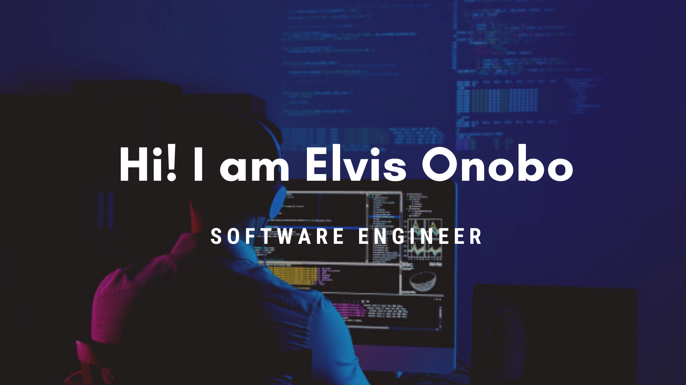

</img>

### Hi there 👋

It's that seafarer turned software developer.

- 🔭 I’m have built [Easy Paystack](https://www.npmjs.com/package/easy-paystack), a Paystack package to make the use of Paystack in
  production apps easy and [Title-Caser](https://www.npmjs.com/package/title-caser) to help fellow devs capitalise the first word in every
  string (best suited for use with user submitted data).

I am also building a React-Starter-Pack and Vue-Starter-Pack to make the basic scaffolding for frontend apps a lot faster.

In trying to build resources for the greater good, I have ended up doing things that I never thought you could.

A wise man once said, **To Teach is to Learn Twice.**

I'm on [Twitter](twitter.com/elvis-onobo)

<!--
**elvis-onobo/elvis-onobo** is a ✨ _special_ ✨ repository because its `README.md` (this file) appears on your GitHub profile.

Here are some ideas to get you started:

- 🔭 I’m currently working on ...
- 🌱 I’m currently learning ...
- 👯 I’m looking to collaborate on ...
- 🤔 I’m looking for help with ...
- 💬 Ask me about ...
- 📫 How to reach me: ...
- 😄 Pronouns: ...
- ⚡ Fun fact: ...
-->
